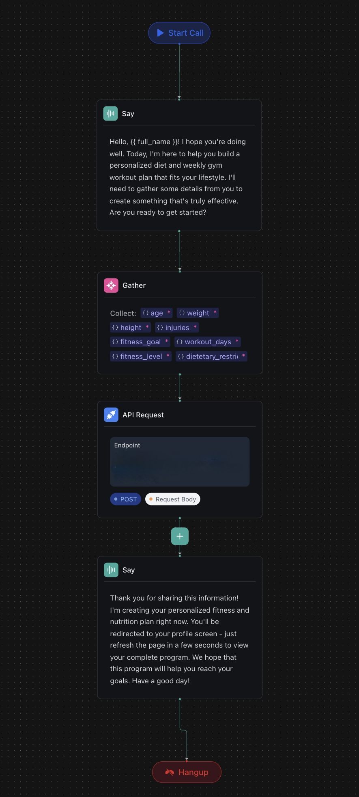

# 🧠 CoachGPT — Your Personal AI Fitness Coach

**CoachGPT** is a web app built with **React** and **Next.js** that allows users to **chat with an AI assistant** to create personalized **fitness and diet plans**. Through a conversational flow, the AI gathers information about the user's goals, lifestyle, and preferences, then generates a customized workout and nutrition strategy tailored specifically for them.

---

## 🚀 How It Works

- 🧩 **Vapi** manages AI-driven voice conversations and custom assistant workflows.
- 🔐 **Clerk** handles secure user authentication.
- 🗄️ **Convex** powers the backend database and server-side processing.
- 🔗 **Webhooks**:
  - Sync **Clerk** user accounts with **Convex** using verified webhooks (secured via **Svix**).
  - Connect AI workflows from **Vapi** to **Convex**, and forward AI tasks to **Gemini** (Google's Generative AI) to create intelligent, personalized fitness and nutrition plans.

---

## 🧠 Key Features

- Gathers user fitness goals, dietary preferences, and lifestyle details
- Instantly generates a tailored workout and meal plan
- Full authentication flow to save and manage user profiles securely

---

## 🖼️ Vapi Workflow Preview

  

---

## 🌐 Live Demo

CoachGPT is available here:  
[https://coachgpt-ai.vercel.app/](https://coachgpt-ai.vercel.app/)

---

## 📚 Learn More

- [Vapi Documentation](https://docs.vapi.ai/)
- [Clerk Authentication Docs](https://clerk.dev/docs)
- [Convex Backend Platform](https://docs.convex.dev/)
- [Svix Webhooks Security](https://docs.svix.com/)
- [Google Generative AI (Gemini)](https://ai.google.dev/)

---

Take control of your fitness journey — let AI coach you to success! 🏋️‍♂️🥗🚀
